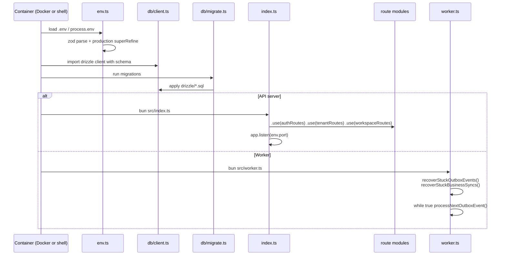
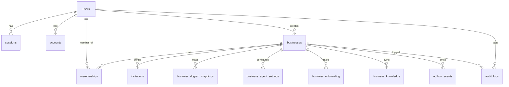

# Architecture

## Module/layer overview

| Layer | Responsibility | Key files | Depends on | Dependents |
|---|---|---|---|---|
| **Web (React)** | Render UI, collect form data, load widget scripts, enforce role-based UI hiding | `app/web/src/main.tsx`, `app/web/src/router.tsx`, `app/web/src/App.tsx` | `api.ts` → API | Browser user |
| **API client (Eden)** | Type-safe HTTP client from generated `App` type, unwraps errors | `app/web/src/api.ts:232` | API `App` type | All route components |
| **HTTP server (Elysia)** | Route registration, CORS, global error handling, request validation | `app/api/src/index.ts:85` | Env, auth routes, workspace routes, tenant routes | Worker (none directly) |
| **Authentication** | better-auth config, session extraction, login/signup/magic/verify endpoints | `app/api/src/auth/config.ts`, `app/api/src/auth/routes.ts` | `db/client`, `db/schema` | `workspace/context.ts`, `tenant/routes.ts` |
| **Workspace** | Business CRUD, team membership, invitations, role checks | `app/api/src/workspace/routes.ts`, `app/api/src/workspace/permissions.ts`, `app/api/src/workspace/context.ts` | `db/schema`, `auth` | HTTP routes |
| **Tenant** | Tenant-scoped settings, knowledge, onboarding, and publish workflow | `app/api/src/tenant/routes.ts` | `workspace/context`, `dograh/tenant`, `outbox` | HTTP routes |
| **Dograh integration** | HTTP client, sync engine, failure classification, workflow desired-state builder | `app/api/src/dograh/client.ts`, `app/api/src/dograh/tenant.ts`, `app/api/src/dograh/config.ts` | Env | `index.ts`, `tenant/routes.ts`, `outbox.ts` |
| **Outbox** | Persistent async job queue backed by `outbox_events` | `app/api/src/outbox.ts` | `db/schema`, `dograh/tenant` | `worker.ts` |
| **Worker** | Polls outbox table and runs handlers | `app/api/src/worker.ts:12` | `outbox.ts` | none (background) |
| **Database** | Drizzle ORM + postgres.js | `app/api/src/db/client.ts`, `app/api/src/db/schema.ts` | Postgres | All API layers |

## Wiring and initialization order

There is no dependency-injection framework. Modules import singletons directly:

- `env` from `app/api/src/env.ts:186` is validated once at import time.
- `db` from `app/api/src/db/client.ts:13` is a single Drizzle client.
- `dograh` from `app/api/src/dograh/client.ts:356` is a single `DograhClient` instance.
- `auth` from `app/api/src/auth/config.ts:10` is a single better-auth instance.

## State management

### Server state

The source of truth for all persistent state is the Vocalonix Postgres database. The Elysia server is stateless; the worker is also stateless and polls the same database. Session state is stored in the `sessions` table and referenced by an HTTP-only `vocalonix_session` cookie (`app/api/src/auth/config.ts:47`).

### Client state

The React frontend uses local `useState` for form and page state. It does not use TanStack Query for caching or mutation in the current code; every route component fetches its own data on mount (`app/web/src/routes/tenant.tsx:68` uses `useEffect` + `useState`). The `AuthProvider` (`app/web/src/auth/AuthProvider.tsx:31`) is the only global React context; it stores the current session and exposes `login`, `logout`, `logoutAll`, and `refresh`.

### Sync state

Each business has a `business_dograh_mappings` row that tracks the desired Dograh workflow state (`app/api/src/db/schema.ts:329`). The mapping contains:

- `syncState` — `pending`, `syncing`, `synced`, `rejected`, `failed`, `offboarding`, `offboarded`.
- `configHash` and `syncedConfigHash` — SHA-256 hashes of the desired and last-successfully-synced workflow definitions.
- `syncLeaseId` / `syncLeaseExpiresAt` — five-minute lease to prevent concurrent syncs (`app/api/src/dograh/tenant.ts:26`).

## Data storage

The database schema is defined in `app/api/src/db/schema.ts` and is physically created/migrated by `app/api/drizzle/0000_crazy_meggan.sql` and later migrations.

### Entity-relationship diagram

### Key tables

| Table | Purpose | Important columns / constraints |
|---|---|---|
| `users` | Account identity | `id`, `email` unique, `emailVerified` (`app/api/src/db/schema.ts:16`) |
| `sessions` | better-auth session rows | `token` unique, FK to `users` (`app/api/src/db/schema.ts:34`) |
| `accounts` | Credential/account provider data | `providerId`+`accountId` unique, FK to `users` (`app/api/src/db/schema.ts:58`) |
| `verifications` | better-auth email verification tokens | `identifier`+`value` (`app/api/src/db/schema.ts:94`) |
| `magic_link_requests` | One-time sign-in links | `tokenHash` unique, `consumedAt`, `expiresAt` (`app/api/src/db/schema.ts:111`) |
| `businesses` | A workspace/tenant | `slug` unique, `createdBy` FK to `users` (`app/api/src/db/schema.ts:181`) |
| `memberships` | User ↔ Business role | Composite PK `(userId, businessId)`, `status` enum (`app/api/src/db/schema.ts:211`) |
| `invitations` | Email-bound pending invites | `tokenHash` unique, partial unique on pending `(businessId, email)` (`app/api/src/db/schema.ts:236`) |
| `audit_logs` | Append-only audit stream | `businessId`, `actorUserId`, `action`, `payload` JSONB (`app/api/src/db/schema.ts:269`) |
| `outbox_events` | Async job queue | `status`, `dedupeKey`, `availableAt`, `attemptCount` (`app/api/src/db/schema.ts:293`) |
| `business_dograh_mappings` | Dograh workflow sync state | `businessId` PK, `workflowId`, `syncState`, `configHash` (`app/api/src/db/schema.ts:329`) |
| `business_agent_settings` | Tenant agent config | `businessId` PK, defaults to Nova/greeting/prompt (`app/api/src/db/schema.ts:362`) |
| `business_onboarding` | Onboarding step tracking | `businessId` PK, `completedSteps` JSONB, `currentStep` (`app/api/src/db/schema.ts:397`) |
| `business_knowledge` | Tenant knowledge sources | `businessId` FK, `state`, `active`, `remoteDocumentUuid` (`app/api/src/db/schema.ts:412`) |

### Where each model is read and written

| Model | Read | Write |
|---|---|---|
| `users` | `auth.api.*`, `workspace/routes.ts:131`, `auth/routes.ts:221` | `auth.api.signUpEmail`, `auth/routes.ts:101` |
| `sessions` | `auth.api.getSession`, `auth/routes.ts:221` | better-auth middleware, `auth/routes.ts:214` |
| `businesses` | `workspace/routes.ts:131`, `tenant/routes.ts:153` | `workspace/routes.ts:158` |
| `memberships` | `workspace/context.ts:17`, `workspace/routes.ts:296` | `workspace/routes.ts:158` (create), `workspace/routes.ts:579` (role), `workspace/routes.ts:653` (revoke), `workspace/routes.ts:742` (accept invite) |
| `invitations` | `workspace/routes.ts:705` | `workspace/routes.ts:338` (create), `workspace/routes.ts:474` (revoke), `workspace/routes.ts:519` (resend), `workspace/routes.ts:742` (accept) |
| `business_dograh_mappings` | `dograh/tenant.ts:61` | `workspace/routes.ts:158` (create), `dograh/tenant.ts:177` (sync) |
| `business_agent_settings` | `tenant/routes.ts:153` | `tenant/routes.ts:153` (ensure), `tenant/routes.ts:209` (profile), `tenant/routes.ts:259` (agent), `tenant/routes.ts:316` (hours), `tenant/routes.ts:350` (widget) |
| `business_onboarding` | `tenant/routes.ts:153` | `tenant/routes.ts:64` (complete step), `outbox.ts:77` (publish) |
| `business_knowledge` | `tenant/routes.ts:549` | `tenant/routes.ts:578` (create), `tenant/routes.ts:746` (delete), `outbox.ts` (reconcile) |
| `outbox_events` | `outbox.ts:146` | `workspace/routes.ts:158` (ensure), `tenant/routes.ts:93` (sync), `outbox.ts` (self-queue) |
| `audit_logs` | — | `workspace/routes.ts` and `tenant/routes.ts` (append-only) |

## Design decisions

1. **Server-only Dograh credentials.** The browser never receives `DOGRAH_API_KEY` or `DOGRAH_SERVICE_PASSWORD`. The API generates an embed token and returns the script URL to the browser (`app/api/src/index.ts:63`).
2. **Single source of truth in Postgres.** The worker polls the same database as the API. This removes the need for a separate job broker and makes the codebase runnable with only Postgres.
3. **Desired-state workflow sync.** `dograh/tenant.ts` builds a deterministic workflow definition from `business_agent_settings` + `business_knowledge`, computes a SHA-256 hash, and only mutates Dograh when the hash changes (`app/api/src/dograh/tenant.ts:117`).
4. **Outbox for async durability.** Every Dograh side effect is persisted as an `outbox_events` row before being attempted. If the process restarts, the worker replays uncompleted events (`app/api/src/outbox.ts:51`).
5. **Role matrix duplicated on client and server.** The server has the real enforcement (`app/api/src/workspace/permissions.ts`), but the web mirrors the matrix in `app/web/src/permissions.ts` to hide UI controls. The server is still authoritative.
6. **Legacy single-workflow path coexists with tenant sync.** `app/api/src/dograh/workflow.ts` manages the unprotected `/secret/*` lab as a single `[Vocalonix]` workflow, while `app/api/src/dograh/tenant.ts` manages per-business workflows under `[Vocalonix:<businessId>]` names (`app/api/src/dograh/config.ts:32`).

## Error handling

All routes use the same `onError` handler (`app/api/src/index.ts:94`):

- `ApiError` returns `{ error, code }` with the status.
- `DograhError` returns 502 (or 503 for unauthorized) with the Dograh message.
- Unexpected errors log to stderr and return `500` with a generic message.

