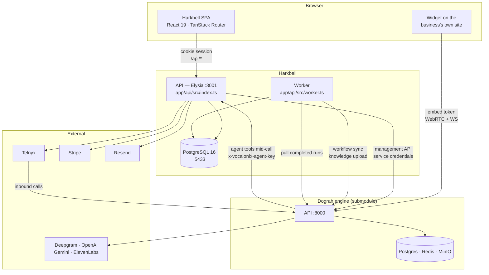
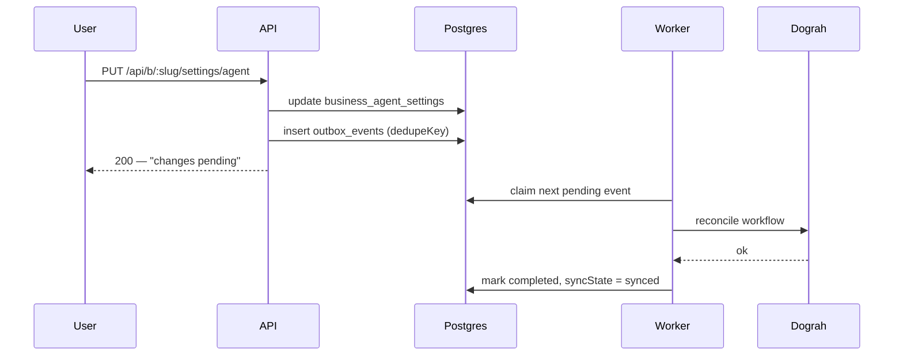

# Architecture

## Topology


```mermaid
flowchart TB
    subgraph browser["Browser"]
        spa["Harkbell SPA<br/>React 19 · TanStack Router"]
        widget["Widget on the<br/>business's own site"]
    end

    subgraph harkbell["Harkbell"]
        api["API — Elysia :3001<br/>app/api/src/index.ts"]
        worker["Worker<br/>app/api/src/worker.ts"]
        pg[("PostgreSQL 16<br/>:5433")]
    end

    subgraph engine["Dograh engine (submodule)"]
        deng["API :8000"]
        dstore[("Postgres · Redis · MinIO")]
    end

    subgraph ext["External"]
        telnyx["Telnyx"]
        stripe["Stripe"]
        resend["Resend"]
        speech["Deepgram · OpenAI<br/>Gemini · ElevenLabs"]
    end

    spa -->|"cookie session<br/>/api/*"| api
    widget -->|"embed token<br/>WebRTC + WS"| deng
    api --> pg
    worker --> pg
    api -->|"management API<br/>service credentials"| deng
    worker -->|"workflow sync<br/>knowledge upload"| deng
    worker -->|"pull completed runs"| deng
    deng -->|"agent tools mid-call<br/>x-vocalonix-agent-key"| api
    deng --> dstore
    deng --> speech
    api --> telnyx
    api --> stripe
    api --> resend
    telnyx -->|"inbound calls"| deng
```

Three of our own processes: **API**, **worker**, **web** (a static bundle behind
nginx in production, Vite in development). They share one Postgres. The worker
is not optional — see [The outbox](#the-outbox).

## Trust boundaries

There are exactly three, and every one of them matters.

**1. Browser → API.** Cookie-authenticated (`vocalonix_session`, HTTP-only,
`SameSite=Lax`, `Secure` in production). CORS is restricted to `APP_ORIGIN`
with `credentials: true`. Every workspace route re-derives the caller's rights
from the database; nothing is trusted from the client.

**2. Browser → Dograh.** The widget talks to the engine directly — it has to,
for WebRTC — but only with a short-lived **embed token** minted server-side by
`dograh.createEmbedToken()`. The browser never holds a Dograh API key, service
password, or provider key. Any change that puts one into a `VITE_*` variable or
a client bundle is a security regression, not a convenience.

**3. Dograh → API.** The engine calls our agent-tool endpoints mid-call. These
have no session and no CSRF token; they authenticate with the
`x-vocalonix-agent-key` header, whose value is
`sha256("vocalonix-agent-tools:" + AUTH_SECRET)` — derived in `env.ts`, never
stored. The comparison lives in `requireAgentKey()` in
`app/api/src/agent/routes.ts`.

## Multi-tenancy

Tenancy is enforced in application code, in one function, and there is no
database-level safety net.

```ts
const workspace = await requireWorkspace(request.headers, params.slug);
requirePermission(workspace.role, "bookings.manage");
```

`requireWorkspace` (`app/api/src/workspace/context.ts`) joins `businesses` to an
**active** `memberships` row for the session user and a non-deleted business.
A non-member gets `404 WORKSPACE_NOT_FOUND`, not 403 — the existence of another
tenant's workspace is not something we confirm.

`requirePermission` checks the matrix in `app/api/src/workspace/permissions.ts`:

| Permission | Owner | Admin | Manager | Staff | Viewer |
|---|:--:|:--:|:--:|:--:|:--:|
| `workspace.view` | ● | ● | ● | ● | ● |
| `callbacks.manage` | ● | ● | ● | ● | |
| `contacts.manage` | ● | ● | ● | ● | |
| `bookings.manage` | ● | ● | ● | ● | |
| `agent.edit` | ● | ● | ● | | |
| `knowledge.manage` | ● | ● | ● | | |
| `bookings.configure` | ● | ● | ● | | |
| `team.manage` | ● | ● | | | |
| `billing.access` | ● | | | | |
| `business.delete` | ● | | | | |

`canManageRole` additionally stops an Admin from acting on an Owner: outside of
Owners, you may only manage strictly lower ranks.

**Every new workspace route must go through both calls.** A handler that reads
`businessId` from anywhere other than a `requireWorkspace` result is a
cross-tenant leak waiting to be found.

## Request lifecycle

1. **CORS** — `@elysiajs/cors` against `env.appOrigins`.
2. **Route plugin** — `index.ts` composes `authRoutes`, `agentToolRoutes`,
   `platformRoutes`, `tenantRoutes`, `workspaceRoutes`, `billingRoutes`,
   `demoRoutes`, then its own legacy handlers.
3. **Body validation** — Elysia's `t.Object({...})` in the route's second
   argument. A failure is caught by `onError` as `VALIDATION` → `422`.
4. **Auth and tenancy** — as above.
5. **Handler** — Drizzle against Postgres, plus `enqueueOutbox` for anything
   the engine must eventually hear about.
6. **Error mapping** — one `onError` in `index.ts`:

   | Thrown | Response |
   |---|---|
   | Elysia `VALIDATION` | 422 `{ error, code: "VALIDATION" }` |
   | Elysia `NOT_FOUND` | 404 |
   | `ApiError` | its own status and code |
   | `DograhError` | its status, or 502 if the engine returned ≥500 |
   | anything else | logged, 500 `"Unexpected server error"` |

   So: throw `ApiError` and the client gets a usable message and a stable code.
   Throw anything else and the user gets nothing useful.

## The outbox

Every side effect that must reach the Dograh engine goes through
`outbox_events`, and only the **worker** performs it.


```mermaid
sequenceDiagram
    participant U as User
    participant A as API
    participant DB as Postgres
    participant W as Worker
    participant E as Dograh

    U->>A: PUT /api/b/:slug/settings/agent
    A->>DB: update business_agent_settings
    A->>DB: insert outbox_events (dedupeKey)
    A-->>U: 200 — "changes pending"
    W->>DB: claim next pending event
    W->>E: reconcile workflow
    E-->>W: ok
    W->>DB: mark completed, syncState = synced
```

Why: an engine call inside a request handler would make a slow or unreachable
engine into a failed user action, and a crash mid-call would leave the database
and the engine permanently disagreeing.

Mechanics (`app/api/src/outbox.ts`):

- **Claim** is a conditional `UPDATE … WHERE status = 'pending'` returning the
  row, so two workers cannot take the same event.
- **Dedupe** — a partial unique index on `dedupe_key` covering only `pending`
  and `processing` rows, with `onConflictDoNothing` on insert. Ten rapid saves
  collapse into one sync; a later save after the first completed enqueues again.
- **Retry** — exponential backoff, `2^(n-1) × 5s` capped at 5 minutes, up to
  `maxAttempts` (8). Retryability comes from `classifyDograhFailure`: a
  `rejected` failure is the engine saying "this configuration is wrong", and
  retrying it is pointless.
- **Polling is not failure** — a handler may return `retryAfterMs` (a document
  still processing). That resets `attemptCount` to 0, so slow-but-healthy work
  never eats the retry budget reserved for real failures.
- **Recovery** — on start, `recoverStuckOutboxEvents()` returns anything left
  `processing` for over 5 minutes back to `pending`. A killed worker self-heals.

Event types: `dograh.workflow.ensure`, `dograh.workflow.sync`,
`dograh.widget.publish`, `dograh.knowledge.upload`,
`dograh.knowledge.reconcile`, `dograh.knowledge.delete`,
`dograh.business.offboard`.

## The worker loop

`app/api/src/worker.ts` — a single sequential loop, deliberately boring:

1. Write a heartbeat file every 10s (`WORKER_HEARTBEAT_PATH`, default
   `/tmp/vocalonix-worker-heartbeat`) — the Compose healthcheck reads it.
2. Every 60s, `ingestAllBusinessRuns()` — pull completed runs out of the engine
   into `call_records`, contacts, callbacks and knowledge gaps.
3. Process one outbox event; if there was none, sleep 1s.

`SIGTERM`/`SIGINT` set a flag and the loop finishes its current event before
exiting, so a deploy never interrupts a sync mid-flight.

## Boot reconcilers

`index.ts` fires three jobs at startup, none awaited — the API must serve health
checks even while the engine is still coming up. Each failure is reported
through the readiness panel rather than blocking boot.

| Job | Purpose |
|---|---|
| `reconcileProviderConfiguration()` | Push the resolved speech stack from our environment into Dograh's organisation model configuration, so the operator never opens the Dograh UI |
| `reconcileTelephonyConfiguration()` | Refresh the Telnyx webhook signing key and re-assert any number that is bought but not actually delivering calls |
| `backfillCallRecords()` | Copy across calls taken before `call_records` existed. Upserts, so re-running is harmless |

The telephony one exists because buying a number, binding it to the call-control
application, and registering the routing record are three separate steps, and a
gap in any one produces a number that bills monthly and never rings. All three
are verified on purchase *and* re-asserted at boot.

## Authentication

better-auth (`app/api/src/auth/config.ts`) with the Drizzle adapter.

- Cookie `vocalonix_session`, HTTP-only, `SameSite=Lax`, `Secure` in production.
- Sessions are database rows (`sessions`), which is what makes "log out
  everywhere" and the session list on `/account` real rather than cosmetic.
- Password and magic-link sign-in. Magic-link tokens are stored **hashed** in
  `magic_link_requests` with an expiry and a `consumed_at`.
- Outside production, verification and magic links are returned in the response
  as preview URLs instead of being emailed — `captureAuthLinks` in
  `auth/email.ts` intercepts them.
- `safeReturnTo()` rejects any redirect target that is not a same-origin path,
  which is what keeps `?redirect=` from becoming an open redirect.
- Per-IP rate limits on signup (10/min), login (20/min), magic link (10/min),
  password confirm (5/min) and demo sessions (10/min).

That limiter is **in-memory** (`app/api/src/rateLimit.ts`). It is correct for
one API instance and silently useless behind two. Moving to a shared store is a
prerequisite for horizontal scaling.

## Frontend ↔ backend typing

`app/web/src/api.ts` builds an `edenTreaty<App>` client against
`typeof app` imported straight from `app/api/src/index.ts`. Route signatures are
shared at the type level with no code generation and no OpenAPI step — which is
why request bodies use Elysia's `t` and why the web `tsconfig` can see the API
source. Break a route's shape and the **web** typecheck fails, which is the
point.

`unwrap()` normalises every response: it throws `ApiClientError(status, code,
message)` when the transport failed *or* when `data` came back null, so a
malformed response surfaces at the call site instead of deep inside a render.

## Where things deliberately are not

- **No SSR.** The web app is a static bundle. nginx serves it; there is no Node
  process in front of the frontend in production.
- **No Stripe SDK.** `billing/routes.ts` calls the REST API with `fetch` and
  verifies webhook signatures with `node:crypto` and `timingSafeEqual`.
- **No job queue service.** The outbox table is the queue. One less thing to
  run, and it is transactional with the data that caused it.
- **No ORM-level tenant scoping.** Enforced in `requireWorkspace` instead. This
  is the highest-risk design decision in the codebase; treat it accordingly.
