# Data model

Source of truth: [`app/api/src/db/schema.ts`](../app/api/src/db/schema.ts).
Migrations: `app/api/drizzle/*.sql`, generated by `bun run db:generate`, applied
by the API container on start.

TypeScript is `camelCase`, Postgres is `snake_case`, and Drizzle maps them
explicitly on every column. Ids are `text` primary keys holding UUIDs generated
in application code (`randomUUID()`), not database sequences.

## Shape

```mermaid
erDiagram
    users ||--o{ memberships : has
    users ||--o{ sessions : has
    businesses ||--o{ memberships : has
    businesses ||--o{ invitations : has
    businesses ||--|| business_agent_settings : configures
    businesses ||--|| business_onboarding : tracks
    businesses ||--|| business_dograh_mappings : "syncs via"
    businesses ||--o{ business_config_versions : publishes
    businesses ||--o{ business_knowledge : teaches
    businesses ||--o{ business_phone_numbers : claims
    businesses ||--o{ call_records : answers
    businesses ||--o{ contacts : knows
    businesses ||--o{ bookings : schedules
    businesses ||--o{ callback_tasks : promises
    businesses ||--o{ knowledge_gaps : discovers
    businesses ||--o{ outbox_events : enqueues
    businesses ||--o{ audit_logs : records
    booking_resources ||--o{ bookings : hosts
    booking_services ||--o{ bookings : defines
    contacts ||--o{ bookings : "linked to"
    contacts ||--o{ callback_tasks : "linked to"
    contacts ||--o{ call_records : "linked to"
```

---

## Identity and access

### `users`, `sessions`, `accounts`, `verifications`
Owned by better-auth through the Drizzle adapter; the shapes are dictated by it.
Sessions are real rows, which is what makes the session list and "log out
everywhere" on `/account` genuine rather than cosmetic. Session lifetime is 30
days, refreshed daily (`auth/config.ts`).

### `magic_link_requests`
Our own record of magic-link issuance. The token is stored **hashed**
(`token_hash`, uniquely indexed) with `expires_at` and `consumed_at`, so a
leaked database row cannot be replayed into a session and a consumed link cannot
be reused.

### `businesses`
The tenant. `slug` is unique and is how every workspace route addresses it.
Soft-deleted via `deleted_at` — `requireWorkspace` filters on it, so a deleted
workspace disappears from the product without destroying its history.

Also carries the billing mirror: `stripe_customer_id`, `plan_name` (a plan **id**
from `billing/plans.ts`, not a display name), `stripe_subscription_id`,
`plan_status`, `plan_period_end`. Stored locally so an entitlement check is a
column read rather than a Stripe call on every request, and so the product keeps
working while Stripe is briefly unreachable. The webhook keeps it honest.

### `memberships`
Composite primary key `(user_id, business_id)`. `role` is the enum
Owner/Admin/Manager/Staff/Viewer; `status` is `active` or `revoked`. Revoking
keeps the row, so re-adding somebody restores rather than duplicates.

### `invitations`
Token stored hashed. The interesting constraint is the **partial unique index**
`invitations_pending_email_unique` on `(business_id, email)` `WHERE accepted_at
IS NULL AND revoked_at IS NULL` — one live invitation per email per business,
while accepted and revoked history is kept.

### `audit_logs`
Append-only. `business_id` and `actor_user_id` are `ON DELETE SET NULL`, so the
record of an action survives the deletion of whoever or whatever it referred to.

---

## Engine integration

### `outbox_events`
The queue. See [Architecture → The outbox](03-architecture.md#the-outbox).
The constraint that makes it work: a **partial unique index** on `dedupe_key`
`WHERE status IN ('pending','processing')`. Ten rapid saves collapse into one
sync; a save after the first completed enqueues a fresh one.

### `business_dograh_mappings`
One row per business — the sync state machine.

| Column | Meaning |
|---|---|
| `workflow_id`, `workflow_uuid` | The engine-side workflow. `workflow_id` is uniquely indexed: two businesses can never point at the same workflow |
| `config_hash` | Hash of the configuration we *want* |
| `synced_config_hash` | Hash of what the engine last accepted |
| `sync_state` | `pending → syncing → synced`, or `rejected` / `failed`, or `offboarding → offboarded` |
| `error_category`, `last_error` | From `classifyDograhFailure` |
| `sync_lease_id`, `sync_lease_expires_at` | A 5-minute lease so two workers cannot sync one business concurrently |
| `last_ingested_run_id` | High-water mark for run ingestion |
| `agent_tool_uuids` | Engine-side ids of the tools registered for this business |

`synchronizationDecision()` compares the two hashes and no-ops when they match.
A `rejected` state with an unchanged hash also no-ops — retrying a configuration
the engine has already refused just burns attempts.

### `platform_settings`
A small key/value store for platform-wide state with no natural home on a
business row: the hash of the model configuration last pushed to Dograh, and the
provisioned telephony ids.

---

## Agent configuration

### `business_agent_settings`
One row per business, created on demand with defaults. Persona (`agent_name`,
`tone`, `voice`, `greeting`, `prompt`, `closing`, `escalation_guidance`),
behaviour (`allow_interrupt`, `transfer_phone`), `business_hours` as JSONB keyed
by weekday, and widget appearance (`widget_button_text`, `widget_color`,
`allowed_domains`).

`transfer_phone` only works on a PSTN leg — a browser caller has no call to hand
over — so the agent is only *told* it can transfer when the business also has a
live number. Otherwise it takes a message, which always works.

### `business_onboarding`
`completed_steps`, `current_step`, `published_at`. `published_at` being non-null
is what "this business is live" means.

### `business_config_versions`
Immutable snapshot of the published configuration, unique on
`(business_id, version)`. Powers the History tab and restore-to-draft.

### `business_knowledge`
What the agent answers from. `kind` is `document`, `text` or
`website_reference`; the bytes live in a `bytea` column so a re-upload after an
engine failure does not need the original file back from the user.

`state` walks `pending → uploading → processing → active`, or `failed`, or
`delete_pending → deleted`. `remote_document_uuid` is uniquely indexed — one
local row per engine document. `replaces_knowledge_id` supports replace-in-place
so the old document is only deleted once the new one is live.

---

## Telephony

### `business_phone_numbers`
Two partial unique indexes carry the weight:

- `business_phone_numbers_e164_active_unique` on `e164` `WHERE status <> 'released'`
  — one live claim per number across the whole platform, while released rows
  stay for history and do not block a later re-claim.
- `business_phone_numbers_one_live_per_business` on `business_id` `WHERE status
  <> 'released'` — two concurrent purchases would both pass the application-level
  check before either inserted, and the loser of that race would leave the
  business paying for a second number it never chose.

`dograh_config_id` and `dograh_phone_number_id` are the engine-side routing
records. A number is only useful when the Telnyx purchase, the connection
binding **and** the engine routing record all exist.

---

## Product data

### `call_records`
One row per completed call, copied out of the engine during ingestion.

The engine stays the system of record for what was *said* — transcripts and
recordings are large, rarely read, and fetched per conversation on demand. What
a call *was* belongs here, because the list, the dashboard and metered billing
all need to count, filter and sum across every call a business ever took, and
none of that is answerable by paging a remote service.

`call_records_business_run_unique` on `(business_id, run_id)` is not decoration:
ingestion is re-runnable and a backfill may overlap it, and counting a call
twice overstates a dashboard and overcharges an invoice.

### `contacts`
People the business knows. `source` is `call`, `manual` or `import`. Soft
deleted. Linked from bookings, callbacks and call records by `contact_id`
(`ON DELETE SET NULL` — deleting a contact must not delete their history).
Matching logic lives in `tenant/contactLink.ts`.

### `booking_resources`, `booking_services`, `bookings`
A resource is a person or a room; a service has a duration, a buffer, a price
and an `agent_bookable` flag. `bookings` records `source` (`agent`, `desk`,
`web`) and keeps `run_id` when the agent made it, so a booking traces back to
the call that produced it. Clash detection is in `agent/slots.ts`.

Booking is only offered to the agent when the business has at least one active
resource **and** one active agent-bookable service.

### `callback_tasks`
Promises to ring someone back. `source` is `call` or `manual`, `status` is
`open`/`spoke`/`voicemail`/`dropped`, and `attempts` is an append-only JSONB log.
Created by the agent mid-call through the `take_message` tool.

### `knowledge_gaps`
Questions the agent could not answer. Unique on
`(business_id, normalized_question)` with an `ask_count`, so the same question
asked forty times is one row that says forty — which is the number that tells a
business what to write down next.

### `demo_sessions`
The public funnel. Intake answers, the throwaway workflow id, transcript,
duration, cost, feedback score and chips, and the client's IP/user-agent/referrer.
Not tenant-scoped — there is no business yet.

---

## Conventions to preserve

- **Soft delete** where history matters (`businesses`, `contacts`,
  `business_knowledge`), hard delete only for genuinely transient rows.
- **`ON DELETE SET NULL`** for references from a record to the actor or subject
  of an event; **`ON DELETE CASCADE`** from a business to its own data.
- **Partial unique indexes** to express "one live X" without losing history.
  Reach for one before reaching for application-level checking — several already
  exist precisely because an application check lost a race.
- **JSONB** for genuinely open-ended shapes (`attempts`, `business_hours`,
  `payload`). Anything you will filter, sort or sum on gets a column.
- **Timestamps are `withTimezone: true`**, always. Business-local time is
  computed from the business's `timezone` column at read time.
