# Flows

This document traces every significant user-facing and internal flow through the codebase. Each flow includes the trigger, a sequence diagram, a step-by-step narrative with file:line references, error paths, and side effects.

## Table of contents

1. [Sign up](#sign-up)
2. [Log in with password](#log-in-with-password)
3. [Request and consume a magic link](#request-and-consume-a-magic-link)
4. [Email verification](#email-verification)
5. [Session restore and refresh](#session-restore-and-refresh)
6. [Log out and log out everywhere](#log-out-and-log-out-everywhere)
7. [Create a business workspace](#create-a-business-workspace)
8. [List and switch workspaces](#list-and-switch-workspaces)
9. [Invite a team member](#invite-a-team-member)
10. [Accept a workspace invitation](#accept-a-workspace-invitation)
11. [Update a member role or revoke membership](#update-a-member-role-or-revoke-membership)
12. [Tenant onboarding and settings update](#tenant-onboarding-and-settings-update)
13. [Publish a business](#publish-a-business)
14. [Tenant knowledge create / replace / delete](#tenant-knowledge-create--replace--delete)
15. [Outbox worker lifecycle](#outbox-worker-lifecycle)
16. [Dograh workflow synchronization](#dograh-workflow-synchronization)
17. [MVP lab: Test agent call](#mvp-lab-test-agent-call)
18. [MVP lab: Knowledge upload](#mvp-lab-knowledge-upload)
19. [MVP lab: Agent settings update](#mvp-lab-agent-settings-update)

---

## Sign up

Trigger: user submits the form at `/signup`.

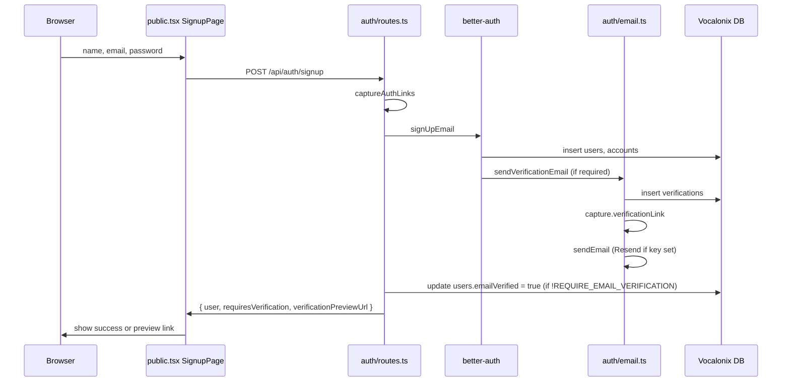

Steps (`app/api/src/auth/routes.ts:80`):

1. `POST /api/auth/signup` receives `name`, `email`, `password`, and optional `returnTo`.
2. `captureAuthLinks()` wraps the better-auth call so `deliverVerificationLink` can write the preview URL back to the response (`app/api/src/auth/email.ts:24`).
3. `auth.api.signUpEmail()` creates `users` and `accounts` rows. better-auth hashes the password.
4. If `REQUIRE_EMAIL_VERIFICATION` is true, `sendVerificationEmail` stores a token in `verifications` and sends via Resend; the verification link is captured in the async store.
5. If `REQUIRE_EMAIL_VERIFICATION` is false, the route immediately sets `users.emailVerified` to true (`app/api/src/auth/routes.ts:101`).
6. The returned cookie `set-cookie` header is forwarded to the browser.
7. The frontend checks `requiresVerification` and either redirects to `intendedRoute()` or shows the local preview link (`app/web/src/routes/public.tsx:220`).

Error paths:

- Validation error (`name` <1 or >120 chars, invalid email, password <8) → `400` from Elysia body validator.
- Email already exists → better-auth returns `409` mapped to `Email or password is incorrect.` (intentionally vague, `auth/routes.ts:23`).
- Resend error → `throw new Error` in `email.ts:56` but only if `RESEND_API_KEY` is set; local dev silently skips sending.

Side effects:

- `users` and `accounts` rows inserted.
- `vocalonix_session` cookie set.
- `verifications` row inserted if email verification is enabled.
- No audit log written for sign-up.

---

## Log in with password

Trigger: user submits the form at `/login`.

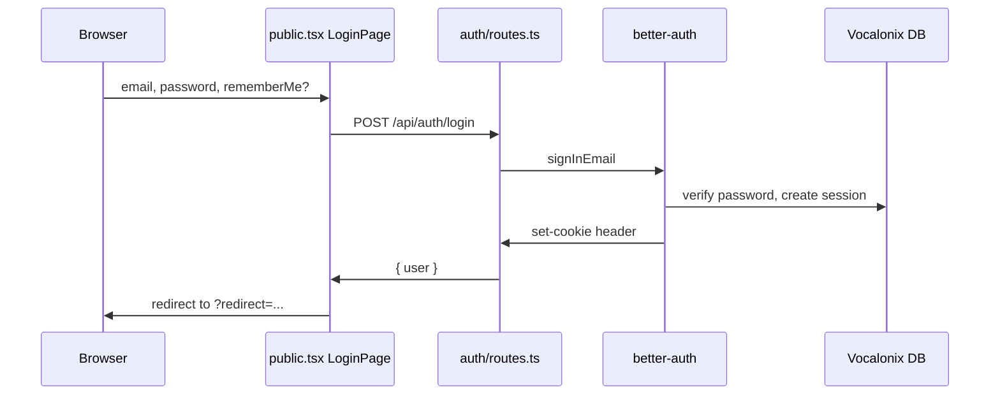

Steps (`app/api/src/auth/routes.ts:135`):

1. `POST /api/auth/login` receives `email`, `password`, optional `rememberMe`.
2. `normalizeEmail(body.email)` lowercases and trims (`app/api/src/auth/email.ts:16`).
3. `auth.api.signInEmail` validates credentials and creates a session.
4. The API forwards the `set-cookie` header to the browser.
5. The frontend stores the session via `AuthProvider.login` then `window.location.replace(intendedRoute())` (`app/web/src/routes/public.tsx:139`).

Error paths:

- `INVALID_EMAIL_OR_PASSWORD` → `401` with message `Email or password is incorrect.` (`auth/routes.ts:25`).
- Other better-auth errors → status and message from the error body.
- Network errors → generic `Unable to sign in.`

Side effects:

- `sessions` row inserted, `vocalonix_session` cookie set.

---

## Request and consume a magic link

Trigger: user enters email at `/magic` or clicks a link in an email.

### Request

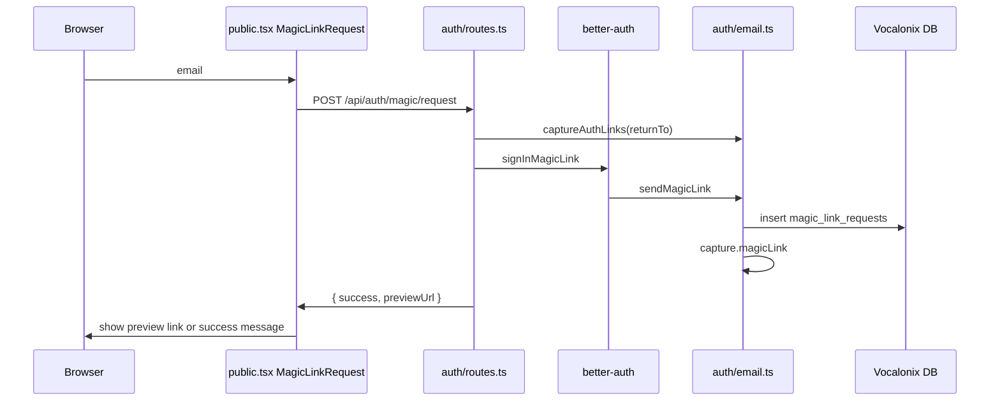

Steps (`app/api/src/auth/routes.ts:248`):

1. `POST /api/auth/magic/request` receives `email` and optional `returnTo`.
2. `captureAuthLinks()` sets the `returnTo` in AsyncLocalStorage.
3. better-auth `magicLink` plugin creates a token, calls `sendMagicLink`.
4. `deliverMagicLink` hashes the token, inserts a row into `magic_link_requests` with `expiresAt` = now + `MAGIC_LINK_TTL_SECONDS` (`app/api/src/auth/email.ts:61`), and stores the constructed `/magic?token=...&redirect=...` URL in the async store.
5. `sendEmail` is called only if `RESEND_API_KEY` is set; local dev returns the preview URL.
6. Response returns `success` and `previewUrl` (null in production).

### Consume

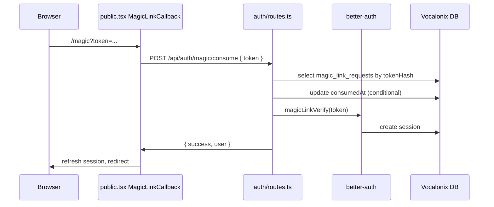

Steps (`app/api/src/auth/routes.ts:280`):

1. `tokenHash = hashAuthToken(body.token)`.
2. Select from `magic_link_requests` by `tokenHash`.
3. If no row → `INVALID_TOKEN` `400`.
4. If `consumedAt` set → `TOKEN_ALREADY_USED` `409`.
5. If `expiresAt <= now` → `TOKEN_EXPIRED` `410`.
6. Conditional `UPDATE ... SET consumedAt = now` is used to detect race conditions; if no row returned, re-check and return the same errors.
7. `auth.api.magicLinkVerify(token)` creates the session.
8. Cookie returned.

Error paths:

- Invalid token, already used, expired, or race condition → detailed status codes above.
- better-auth rejects the token → `500` with generic message.

Side effects:

- `magic_link_requests.consumedAt` set.
- `sessions` row inserted.

---

## Email verification

Trigger: user clicks `/verify-email?token=...`.

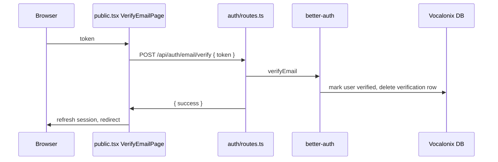

Steps (`app/api/src/auth/routes.ts:368`):

1. `POST /api/auth/email/verify` receives `token`.
2. `auth.api.verifyEmail` validates the token and updates the user.
3. The API forwards any `set-cookie` header.
4. The frontend calls `auth.refresh()` and redirects to `intendedRoute()` on success.

Error paths:

- Invalid/expired token → `400` with `This verification link could not be used.`

---

## Session restore and refresh

Trigger: page load or `AuthProvider` mount; `/api/auth/session` or `/api/auth/refresh`.

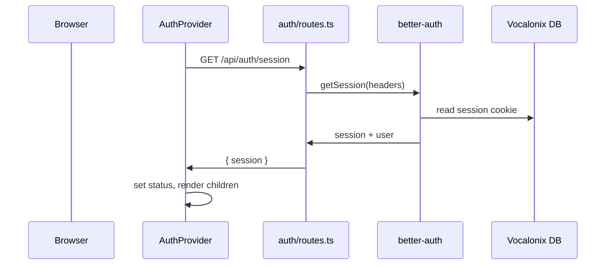

Steps (`app/api/src/auth/routes.ts:171`):

1. `GET /api/auth/session` reads the `vocalonix_session` cookie from `request.headers`.
2. better-auth `getSession` returns the user and session.
3. The response is normalised to `{ user: { id, name, email, emailVerified }, session: { id, createdAt, updatedAt, expiresAt } }`.
4. `refresh` does the same thing with `disableCookieCache: true` to force a refresh (`app/api/src/auth/routes.ts:184`).

Error paths:

- No cookie or invalid session → `session` is `null`.
- Malformed better-auth error → `ApiError` with `UNAUTHENTICATED`.

---

## Log out and log out everywhere

### Log out

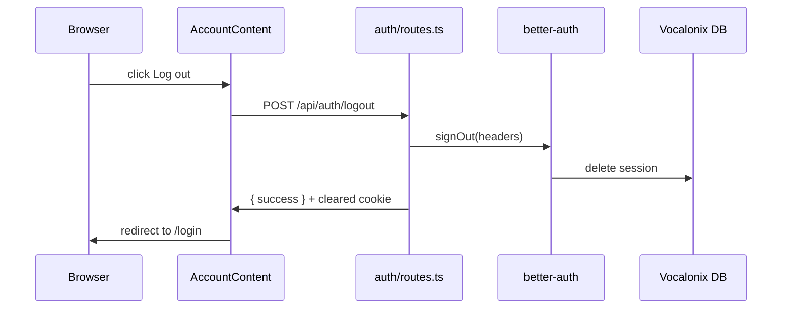

Steps (`app/api/src/auth/routes.ts:198`):

1. `POST /api/auth/logout` calls `auth.api.signOut`.
2. The better-auth response returns a cleared cookie.
3. If better-auth does not return a cookie, the API constructs one with `Max-Age=0` (`app/api/src/auth/routes.ts:34`).

### Log out everywhere

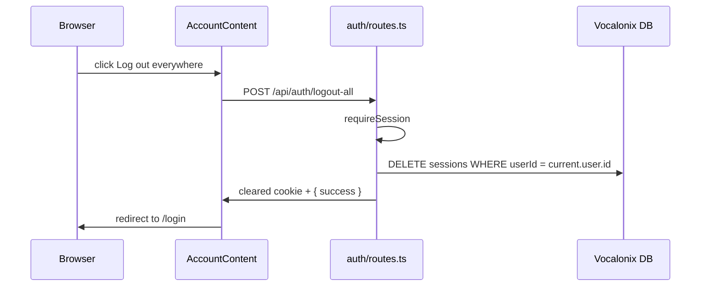

Steps (`app/api/src/auth/routes.ts:211`):

1. `requireSession` validates the current session.
2. `db.delete(sessions).where(eq(sessions.userId, current.user.id))` deletes all rows.
3. API sets `vocalonix_session=; Max-Age=0`.

Side effects:

- `sessions` rows deleted.

---

## Create a business workspace

Trigger: user submits `/app/onboarding/create`.

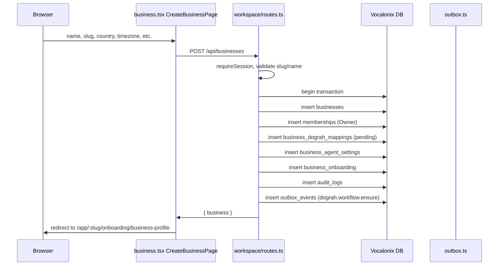

Steps (`app/api/src/workspace/routes.ts:158`):

1. `POST /api/businesses` requires a session.
2. Slug is lowercased and trimmed; validated against `/^[a-z0-9]+(?:-[a-z0-9]+)*$/` (`workspace/routes.ts:29`).
3. Name must be ≥2 characters.
4. In one transaction:
   - Insert `businesses` with `createdBy`.
   - Insert `memberships` with role `Owner`, status `active`.
   - Insert `business_dograh_mappings` with `syncState` `pending`.
   - Insert `business_agent_settings` with defaults.
   - Insert `business_onboarding` with `currentStep` `business-profile`.
   - Insert `audit_logs` `business.create`.
   - Insert `outbox_events` `dograh.workflow.ensure`.
5. If Postgres unique violation (`23505`) on slug → `SLUG_TAKEN` `409`.

Error paths:

- Invalid slug → `400 INVALID_SLUG`.
- Name too short → `400 INVALID_BUSINESS_NAME`.
- Slug duplicate → `409 SLUG_TAKEN`.
- Authentication failure → `401 UNAUTHENTICATED`.

Side effects:

- One business row, one membership row, mapping, settings, onboarding, audit log, and outbox event.

---

## List and switch workspaces

Trigger: `/app` page load or workspace selector change.

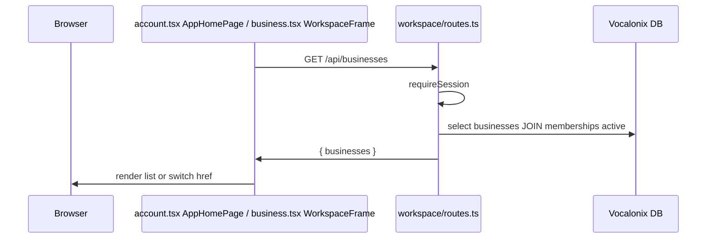

Steps (`app/api/src/workspace/routes.ts:130`):

1. `GET /api/businesses` selects active memberships joined to non-deleted businesses where `userId` matches the session.
2. Returns `id, slug, name, initial, city, country, timezone, role, joinedAt`.
3. The workspace selector uses `workspaceTarget(pathname, targetSlug)` to preserve the tail (`business.tsx:174`).

Error paths:

- Not authenticated → `401`.

---

## Invite a team member

Trigger: owner/admin clicks **Invite member** in `/app/:slug/team`.

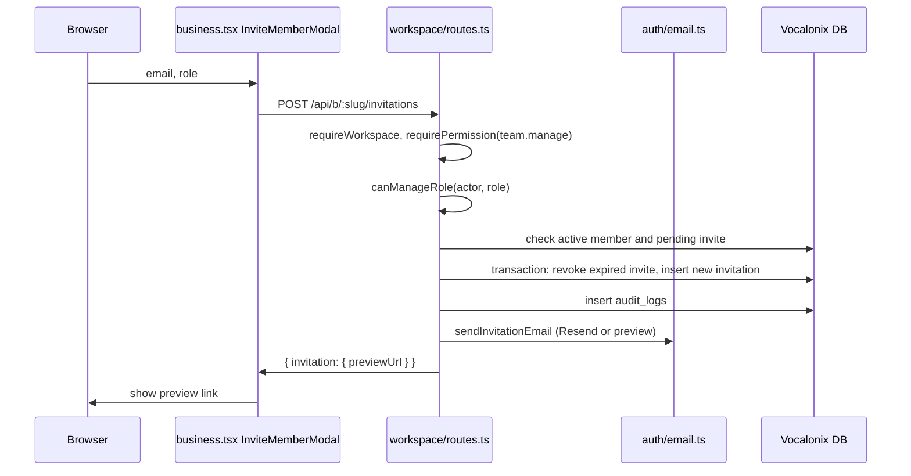

Steps (`app/api/src/workspace/routes.ts:338`):

1. `requireWorkspace` validates session and membership (`workspace/context.ts:17`).
2. `requirePermission(role, "team.manage")` checks role matrix (`workspace/permissions.ts:28`).
3. `canManageRole` prevents assigning a higher or equal role than the actor (`workspace/permissions.ts:32`).
4. Rejects if an active member already has that email, or if a pending non-expired invitation exists.
5. In a transaction, revokes expired invitations for that email and inserts a new invitation with `tokenHash` and `expiresAt` = now + 7 days (`workspace/routes.ts:31`).
6. Audit log `team.invite` inserted.
7. `sendInvitationEmail` constructs the preview URL and sends via Resend if configured.

Error paths:

- `team.manage` denied → `403 MISSING_PERMISSION`.
- `role` not manageable → `403 ROLE_NOT_MANAGEABLE`.
- Already active member → `409 ALREADY_MEMBER`.
- Pending invitation → `409 INVITATION_PENDING`.

Side effects:

- `invitations` row inserted.
- `audit_logs` row inserted.
- Email sent (or preview URL returned in dev).

---

## Accept a workspace invitation

Trigger: invitee clicks `/invite/:token`.

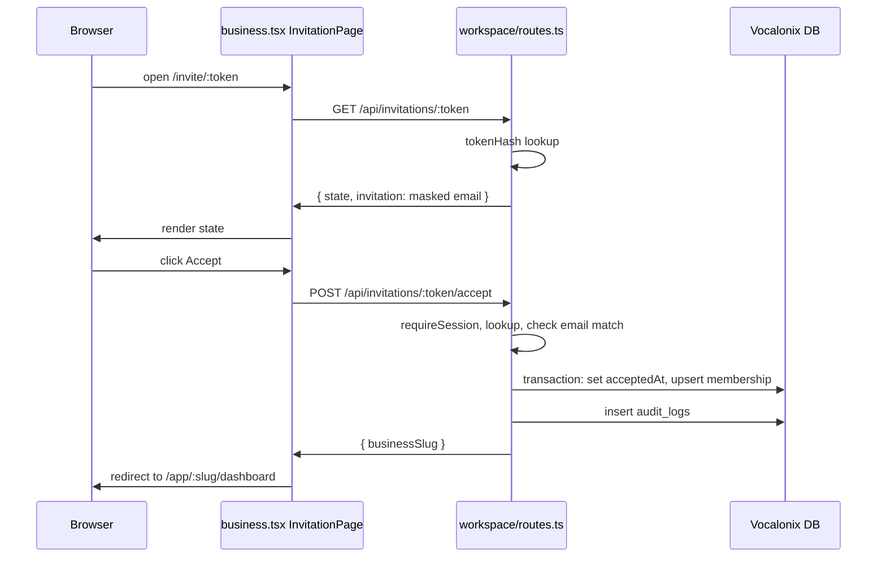

Steps (`app/api/src/workspace/routes.ts:705` and `742`):

1. `GET /api/invitations/:token` returns `state` and masked `invitation`.
2. `POST /api/invitations/:token/accept` requires session.
3. If `normalizeEmail(session.user.email) !== invitation.email` → `403 INVITATION_EMAIL_MISMATCH`.
4. If `invitationState` is not `valid` → `410` or `409`.
5. Transaction updates `invitations.acceptedAt` and inserts or reactivates `memberships` with `onConflictDoUpdate` for revoked rows (`workspace/routes.ts:801`).
6. Audit log `team.invite.accept`.

Error paths:

- Not logged in → browser shown login/signup buttons with `?redirect=` to the invite URL.
- Wrong email → `403 INVITATION_EMAIL_MISMATCH`.
- Expired/revoked/accepted/already member → `409`/`410`.

Side effects:

- `invitations` updated, `memberships` upserted.

---

## Update a member role or revoke membership

Trigger: owner/admin changes role in team table or clicks Revoke.

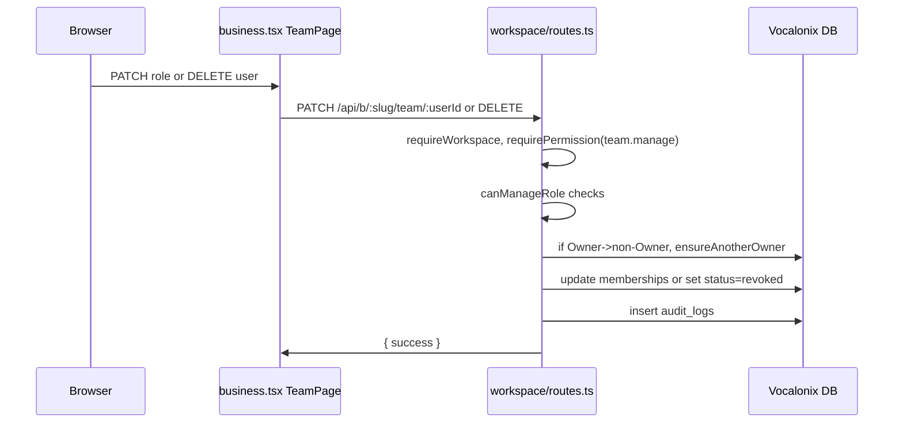

Steps (`workspace/routes.ts:579` and `653`):

1. `PATCH` validates target membership exists, active, and actor can manage both current and target role.
2. If demoting an Owner, `ensureAnotherOwner` verifies another active Owner exists (`workspace/routes.ts:104`).
3. `DELETE` sets `memberships.status = 'revoked'` and `revokedAt`.
4. Audit log `team.member.role.update` or `team.member.revoke`.

Error paths:

- Last owner demotion → `409 LAST_OWNER`.
- Insufficient permissions → `403`.
- Member not found → `404`.

---

## Tenant onboarding and settings update

Trigger: user navigates `/app/:slug/settings/*` or `/app/:slug/onboarding/:step`.

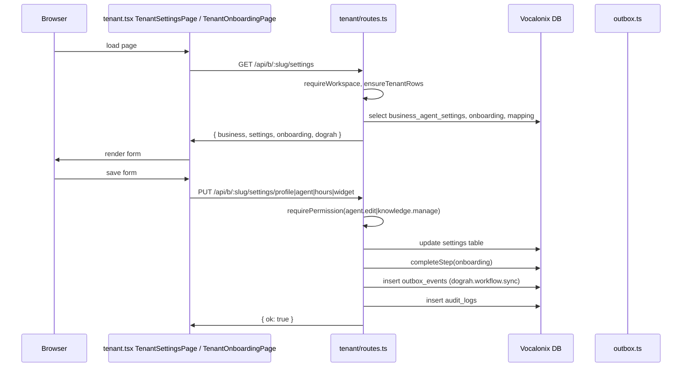

Steps (`app/api/src/tenant/routes.ts:153`, `209`, `259`, `316`, `350`):

1. `GET /api/b/:slug/settings` joins `businessAgentSettings`, `businessOnboarding`, and `businessDograhMappings` and returns them with the business profile.
2. `ensureTenantRows` inserts default rows if missing (`tenant/routes.ts:51`).
3. `PUT .../profile` updates `businesses` and `businessAgentSettings` and marks `business-profile` step complete.
4. `PUT .../agent` updates agent fields and marks `agent` step complete.
5. `PUT .../hours` updates `businessHours` JSONB.
6. `PUT .../widget` updates `widgetButtonText`, `widgetColor`, and `allowedDomains`.
7. Each mutating endpoint calls `queueBusinessSync` (`tenant/routes.ts:93`) which inserts an `outbox_events` row with `dedupeKey` `dograh.workflow.sync:<businessId>`.

Error paths:

- `agent.edit` denied → `403`.
- `knowledge.manage` denied for knowledge pages → `403`.
- Validation errors (e.g. hex colour, HH:MM) → `400`.
- Domain parse failure → `400 ALLOWED_DOMAIN_INVALID`.

Side effects:

- Settings row updated, onboarding step marked, audit log appended, outbox sync queued.

---

## Publish a business

Trigger: user clicks **Publish this business** on the onboarding review step.

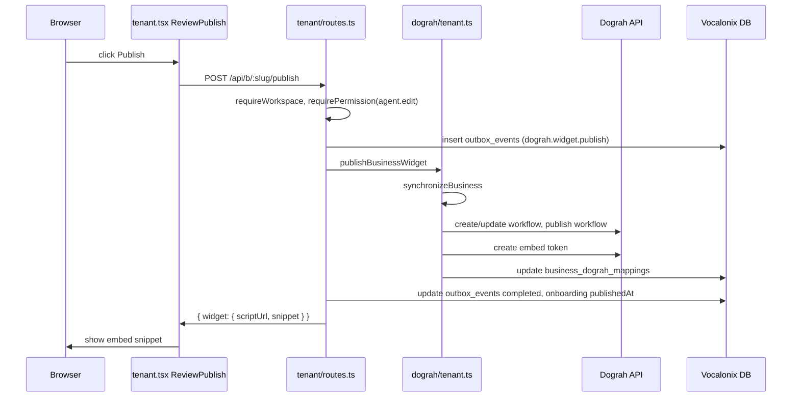

Steps (`app/api/src/tenant/routes.ts:454`):

1. `requireWorkspace` and `requirePermission(agent.edit)`.
2. Inserts `outbox_events` `dograh.widget.publish` with `availableAt` now + 30s, dedupe key.
3. Calls `publishBusinessWidget(businessId, { force: true })` (`app/api/src/dograh/tenant.ts:374`).
4. `publishBusinessWidget` first calls `synchronizeBusiness` to create/update the workflow in Dograh.
5. Then creates an embed token with `widgetTokenSettings` and the allowed domains.
6. Returns `tokenSettings`, `allowedDomains`, `scriptUrl`, `snippet`.
7. Endpoint updates `outbox_events` to `completed`, `businessOnboarding.publishedAt`, and `completedSteps` includes `review`.

Error paths:

- Dograh unavailable → `502` or `503`.
- Dograh rejects config → `422`.
- `WIDGET_NOT_PUBLISHED` returned by `GET /api/b/:slug/widget` if not synced.

Side effects:

- Workflow created/updated in Dograh.
- Embed token created in Dograh.
- `outbox_events` completed, onboarding published.

---

## Tenant knowledge create / replace / delete

### Create / replace

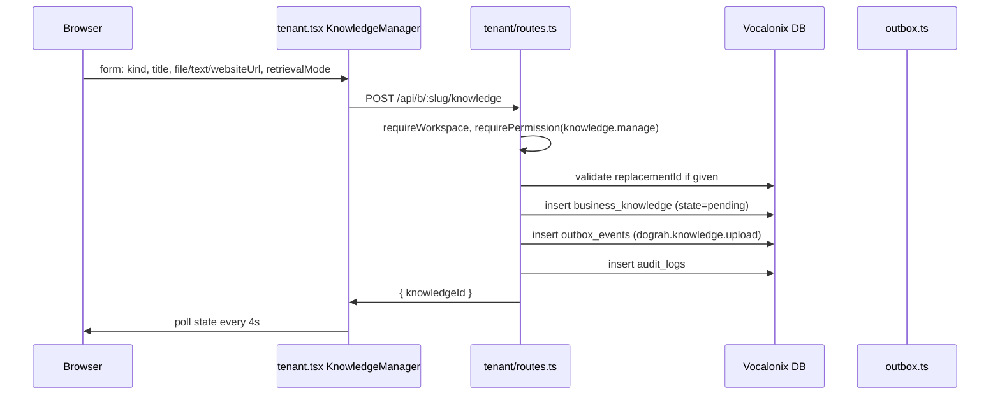

Steps (`app/api/src/tenant/routes.ts:578`):

1. Accepts `kind` (`document`, `text`, `website_reference`), `title`, optional `text`, `websiteUrl`, `file`, `retrievalMode`, `replacementId`.
2. For documents: validates size ≤10MB and extension against `uploads.ts` whitelist.
3. For website references: parses URL, stores text `Website reference: <url>\n...`.
4. Stores source bytes or text in `business_knowledge`.
5. Inserts `outbox_events` `dograh.knowledge.upload` with dedupe key.
6. The worker uploads to Dograh storage, processes, reconciles, and then triggers a workflow sync.

### Delete

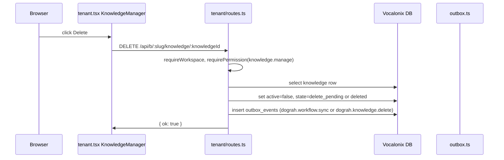

Steps (`app/api/src/tenant/routes.ts:746`):

1. Select the knowledge row (not deleted, owned by business).
2. If active, set `state='delete_pending'` and queue `dograh.workflow.sync` to remove the doc from the workflow.
3. If not active but has a `remoteDocumentUuid`, queue `dograh.knowledge.delete`.
4. Audit log `business.knowledge.delete`.

Error paths:

- `knowledge.manage` denied → `403`.
- File too large or wrong type → `413`/`400`.
- Replacement not found → `404`.

Side effects:

- `business_knowledge` row inserted/updated.
- Outbox events queued.
- Remote document uploaded/processed/deleted by worker.

---

## Outbox worker lifecycle

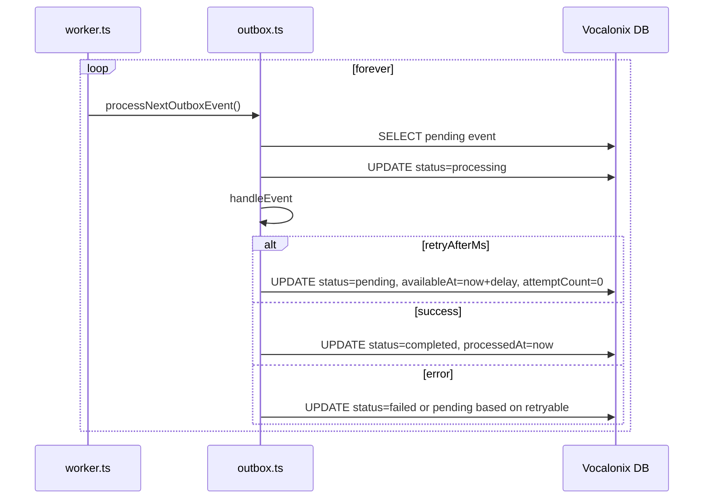

Steps (`app/api/src/outbox.ts:254` and `app/api/src/worker.ts:12`):

1. Worker starts, calls `recoverStuckOutboxEvents` and `recoverStuckBusinessSyncs`.
2. `processNextOutboxEvent` claims the oldest pending event (`status='pending'`, `availableAt <= now`) and sets `status='processing'`.
3. `handleEvent` dispatches by `eventType`:
   - `dograh.workflow.ensure` / `dograh.workflow.sync` → `synchronizeBusiness`.
   - `dograh.widget.publish` → `publishBusinessWidget` and update onboarding.
   - `dograh.knowledge.upload` → `uploadKnowledgeSource` and queue `dograh.knowledge.reconcile`.
   - `dograh.knowledge.reconcile` → `reconcileKnowledge` (returns `retryAfterMs` if still processing).
   - `dograh.knowledge.delete` → `deleteRemoteKnowledge`.
   - `dograh.business.offboard` → `offboardBusiness`.
4. Success: `status='completed'`, `processedAt=now`.
5. Retryable failure: `status='pending'`, `availableAt=now + backoff`, `attemptCount` increments; `pollRescheduleUpdate` resets `attemptCount` to 0 for healthy polling states (`app/api/src/outbox.ts:202`).
6. Non-retryable or exhausted: `status='failed'`.

---

## Dograh workflow synchronization

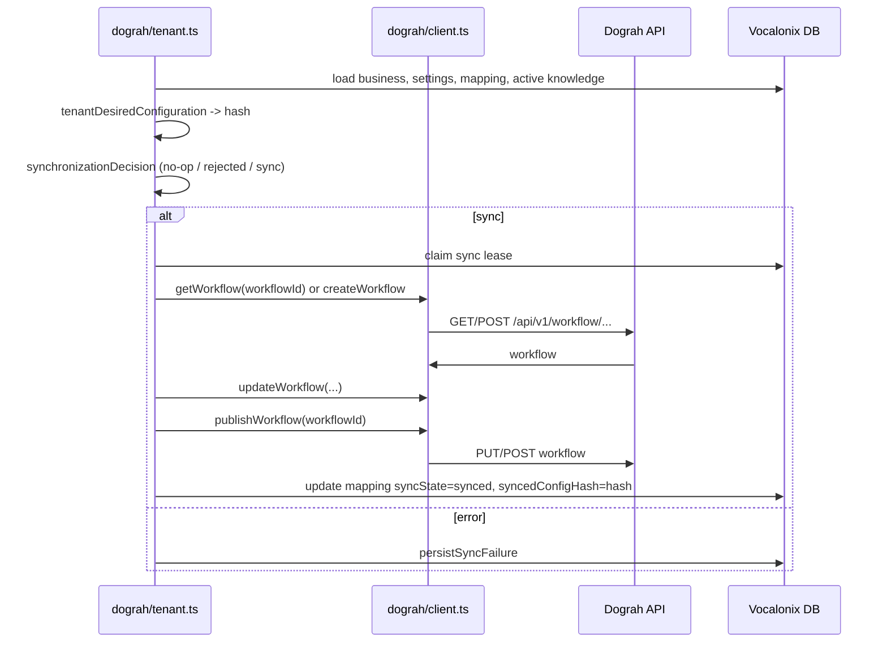

Steps (`app/api/src/dograh/tenant.ts:177`):

1. Load `business`, `businessAgentSettings`, `businessDograhMappings`, and active `businessKnowledge` rows.
2. Compute `tenantDesiredConfiguration` (`app/api/src/dograh/config.ts:187`) including a stable SHA-256 hash.
3. `synchronizationDecision` (`app/api/src/dograh/tenant.ts:117`):
   - If `synced` and `syncedConfigHash === desiredHash` → `no-op`.
   - If `rejected` and `configHash === desiredHash` → `rejected`.
   - Else → `synchronize`.
4. Claim a five-minute lease on `business_dograh_mappings`.
5. If `workflowId` exists, `getWorkflow` and verify the embedded `business_id` in metadata matches.
6. If missing or 404 (with `force`), create the workflow.
7. `updateWorkflow` with desired definition and `workflowConfigurations`, then `publishWorkflow`.
8. Update mapping with `syncState='synced'`, `syncedConfigHash=hash`, `lastSuccessAt`.
9. On any error, `classifyDograhFailure` (`app/api/src/dograh/errors.ts:25`) decides if it is retryable and stores the failure.

---

## MVP lab: Test agent call

Trigger: user opens `/secret/test-agent`.

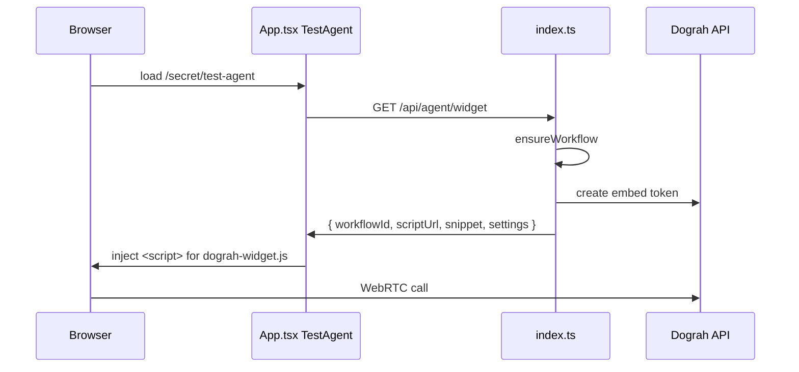

Steps (`app/api/src/index.ts:63` and `app/web/src/App.tsx:44`):

1. `GET /api/agent/widget` calls `ensureWorkflow` (`app/api/src/dograh/workflow.ts:187`), which searches for a workflow whose name starts with `[Vocalonix]` and creates one if missing.
2. `readSettings` extracts agent settings from workflow metadata (`app/api/src/dograh/workflow.ts:31`).
3. `dograh.createEmbedToken` creates a public embed token with `widgetSettings`.
4. The script URL is `http://localhost:3000/embed/dograh-widget.js?token=...&environment=local&apiEndpoint=...`.
5. The React component appends the script, listens for `onStatusChange` and `onError`, and displays the `dograh-inline-container`.

Error paths:

- Dograh not healthy → `api.status()` fails and UI shows `Dograh offline`.
- Script load error → `setError('The Dograh widget could not be loaded.')`.

⚠️ Caveat: the `/secret/*` routes are intentionally unauthenticated. Do not use them for production data.

---

## MVP lab: Knowledge upload

Trigger: user drops a file in `/secret/knowledge-base`.

```mermaid
sequenceDiagram
    participant U as Browser
    participant W as App.tsx KnowledgeBase
    participant A as index.ts
    participant D as Dograh API

    U->>W: select file, retrievalMode
    W->>A: POST /api/knowledge { file, retrievalMode }
    A->>A: validate size/type
    A->>D: requestUpload
    D->>A: upload_url, document_uuid, s3_key
    A->>D: uploadFile(upload_url, file)
    A->>D: processDocument
    A->>W: { document }
    W->>U: poll document list
```

Steps (`app/api/src/index.ts:174`):

1. Max size 5MB (`MAX_UPLOAD_BYTES` at `index.ts:23`).
2. `isAllowedDocumentFilename` checks extension (`app/api/src/uploads.ts:15`).
3. `dograh.requestUpload` gets a presigned MinIO URL.
4. `dograh.uploadFile` PUTs the file to MinIO.
5. `dograh.processDocument` tells Dograh to process the document.
6. The frontend refreshes the document list every 4 seconds while any document is `pending`/`processing`.

---

## MVP lab: Agent settings update

Trigger: user clicks **Save & publish** in `/secret/agent-settings`.

```mermaid
sequenceDiagram
    participant U as Browser
    participant W as App.tsx AgentSettingsView
    participant A as index.ts
    participant D as Dograh API

    U->>W: edit settings
    W->>A: PUT /api/agent
    A->>A: validateSettings
    A->>A: saveSettings
    A->>D: updateWorkflow, publishWorkflow
    A->>D: createEmbedToken
    A->>W: { workflow, settings }
    W->>U: show success message
```

Steps (`app/api/src/index.ts:140`):

1. `validateSettings` enforces required fields, max lengths, and `widgetColor` is a 6-digit hex (`index.ts:25`).
2. `saveSettings` calls `ensureWorkflow`, then `dograh.updateWorkflow` and `publishWorkflow` (`app/api/src/dograh/workflow.ts:199`).
3. `dograh.createEmbedToken` regenerates the embed token.
4. The frontend refreshes the widget snippet.

Error paths:

- Validation failure → `400` with field-specific message.
- Dograh update failure → `502` or `503`.

