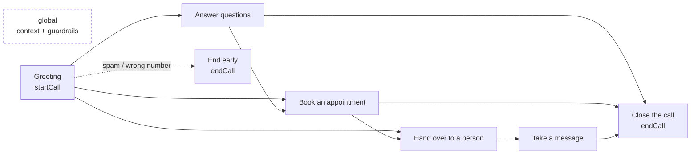
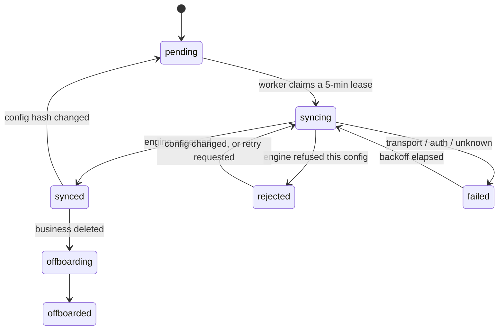

# The voice engine

Everything in `app/api/src/dograh/`, `app/api/src/platform/` and
`app/api/src/agent/`. This is the part of the system that turns a business's
configuration into an agent that answers a phone.

## Dograh

A self-hosted, open-source voice-agent engine, vendored as a git submodule at
`dograh/` and pinned to v1.41.0. It owns media, model orchestration, the call
graph runtime, transcripts, recordings and the public embed protocol.

**We do not modify it.** It is a dependency that happens to be checked out. An
upgrade is a deliberate submodule bump with its own testing, never an incidental
part of another change. Read it freely — `dograh/api/services/voice_prompting_guide/`
in particular is what the prompt style in `config.ts` follows.

Our side speaks to it through `DograhClient` (`dograh/client.ts`), which
authenticates with either `DOGRAH_API_KEY` or the service email/password pair
and handles login, workflow CRUD, document upload, tool registration, embed
tokens, run listing and health.

## Provisioning speech providers

The operator never opens the Dograh dashboard.

```
.env keys → resolveVoiceStack() → modelConfigurationPayload()
          → PUT /organizations/model-configurations/v2 → platform_settings
```

`platform/voiceStack.ts` is pure: it reads `env`, decides which stack the
available keys can support, and produces the payload.
`platform/providers.ts` pushes it at API boot and records the result so
`GET /api/platform/status` can report it.

### The two stacks

**pipeline** — separate STT, LLM and TTS. The default whenever the keys allow
it. Transcription is a first-class stream, so barge-in and knowledge answers
behave predictably, and each business can have its own TTS voice.

**realtime** — one speech-to-speech model. Fewer keys to buy, but the caller's
words only surface when the model chooses to emit them, which is what made
spoken demos unreliable. Used when realtime is all the available keys can drive,
or when explicitly requested.

`VOICE_STACK` selects: `auto` (prefer pipeline when possible), `pipeline`,
`realtime`.

### Provider resolution

| Slot | Order of preference |
|---|---|
| STT | Deepgram (`VOICE_STT_MODEL`, default `nova-3-general`) |
| Pipeline LLM | OpenAI (`VOICE_LLM_MODEL`) → Google (`gemini-flash-latest`) |
| Pipeline TTS | Deepgram → OpenAI → Cartesia (needs `CARTESIA_VOICE_ID`) → ElevenLabs (needs `ELEVENLABS_VOICE_ID`) |
| Realtime | Google (`VOICE_REALTIME_MODEL`) → OpenAI (`gpt-realtime-2`) |

`canRunPipeline` requires Deepgram **and** a usable LLM **and** a usable TTS.
`resolveVoiceStack` never throws — an unconfigured platform is a state the
readiness panel renders, not an error.

### Per-business voices

Eight catalogue voices in `voices.ts`, mapped per provider. A business on the
default voice inherits the organisation configuration, which keeps the common
case free of an extra provider validation. A business that picked something else
gets a per-workflow `model_configuration_v2_override` — which is how two tenants
on one platform sound different. `stackSupportsPerBusinessVoice()` says whether
the active stack can honour that at all.

---

## Workflow generation

`dograh/config.ts` builds the graph for one business. It is deterministic: the
same configuration always produces the same workflow and the same hash.

### The graph



Seven nodes, all prefixed `vocalonix-`. The booking node only exists when the
business has an active resource **and** an active agent-bookable service. The
message node is always available; the transfer tool is attached to the handover
node only when the business has a live phone number **and** a transfer number,
because a warm transfer needs a PSTN leg to hand over.

The **global node** carries live local time, the real opening hours, real
services and prices, the trade rules from `VERTICAL_AGENT_RULES`, and hard
limits on what the agent may claim.

Every conversational node runs extraction against `CALLER_EXTRACTION_PROMPT`,
which is how a call turns into a contact.

### `TENANT_CONFIG_VERSION`

A constant at the top of `config.ts`, currently `4`, and part of the config hash.

**Bump it whenever the shape of a generated workflow changes** — nodes, edges,
tool wiring, prompt structure. Because it feeds the hash, bumping it makes every
business re-sync on the next deploy. Forget it, and existing tenants keep the
old graph forever while new ones get the new one, and you will debug the
difference for a day.

---

## The sync engine

`dograh/tenant.ts`. Reconciles what a business *should* have on the engine with
what it *does* have.



1. `loadTenantConfiguration()` gathers the business, agent settings, active
   knowledge, bookable services, active resources and claimed numbers.
2. `tenantDesiredConfiguration()` produces the workflow and a stable hash of it.
3. `synchronizationDecision()` returns:
   - **no-op** — `synced` and the hashes match,
   - **rejected** — already refused, and the config has not changed since,
   - **synchronize** — otherwise.
4. A **5-minute lease** (`sync_lease_id`) stops two workers syncing one business
   at once.
5. Before writing, ownership is verified: the workflow's
   `metadata.vocalonix.business_id` must match. We never mutate a workflow that
   is not ours.
6. Failures go through `classifyDograhFailure()` into a category, which decides
   whether the outbox retries at all. `rejected` means the configuration is
   wrong, and retrying it is pointless.

`recoverStuckBusinessSyncs()` runs at worker start and releases expired leases.

### What is in the hash

The whole desired configuration, plus `TENANT_CONFIG_VERSION`, plus the agent
tool URLs — which is why moving the API (`HARKBELL_INTERNAL_URL`) automatically
re-registers every agent's tools. That was a bug fix, not an accident: the tools
kept pointing at an address the engine could no longer resolve.

---

## Agent tools

`dograh/agent-tools.ts` registers HTTP tools on the engine;
`agent/routes.ts` serves them.

| Tool | Endpoint | What it does |
|---|---|---|
| `check_availability` | `POST /api/agent-tools/:businessId/availability` | Real open slots for one service on one day |
| `book_appointment` | `POST /api/agent-tools/:businessId/book` | Creates a real `bookings` row, with clash detection |
| `take_message` | `POST /api/agent-tools/:businessId/message` | Creates a real `callback_tasks` row mid-call |
| `transfer_call` | *(engine-side)* | Warm transfer on a PSTN leg |

Each tool's `description` carries its **firing rule** as well as what it does —
Dograh's guidance is that a model picking the wrong tool is usually a description
problem, not a prompt problem. `check_availability`'s description says, in as
many words, never to offer a slot it has not checked.

Auth is the `x-vocalonix-agent-key` header:
`sha256("vocalonix-agent-tools:" + AUTH_SECRET)`. No session, no CSRF, no
tenancy check beyond the `:businessId` in the path — the shared secret is the
authorisation. It rotates automatically with `AUTH_SECRET`, and because the URL
is in the config hash, a rotation re-registers every agent.

Availability maths lives in `agent/slots.ts` and is business-timezone-aware
throughout (`zonedTimeToUtc`, `todayInTimeZone`, `weekdayInTimeZone`,
`computeOpenSlots`, `resourceIsFree`). Do not do date arithmetic outside it.

---

## Knowledge

```
upload → business_knowledge (bytea)  → outbox: knowledge.upload
       → engine document + process   → outbox: knowledge.reconcile (polls)
       → state = active              → outbox: workflow.sync (attach to nodes)
```

The bytes are kept locally in a `bytea` column so a retry after an engine
failure does not need the original file back from the user. Reconciliation
returns `"pending"` while the engine is still processing, which reschedules the
event **without** consuming the retry budget. Deletion is soft locally, then
`knowledge.delete` removes it remotely. Replacement uses
`replaces_knowledge_id` so the old document only goes once the new one is live.

Uploads are checked twice: an extension allow-list (PDF, DOC, DOCX, TXT, JSON),
a 10 MB ceiling, and a **magic-byte signature check** so a renamed executable is
rejected (`uploads.ts`).

---

## Ingestion — calls becoming product data

`dograh/ingest.ts`, run by the worker every 60 seconds.

For each business, from `last_ingested_run_id` forward:

1. **`call_records`** — upserted on `(business_id, run_id)`. Duration, mode,
   disposition, nodes visited, whether a transcript or recording exists, caller
   number.
2. **Contacts** — `extractCaller()` pulls a name, phone and email out of the
   run's extraction context. `sanitizedName/Phone/Email` refuse to invent
   anything the caller did not say. `withCallerId` falls back to the PSTN caller
   ID, so even a caller who says nothing gets a contact record.
3. **Knowledge gaps** — `gapsFromContext()` finds questions the agent could not
   answer; `normalizeQuestion()` collapses phrasings so the same question asked
   forty times is one row with `ask_count = 40`.
4. **Transcript mining** — `extract.ts` runs an LLM (`GEMINI_EXTRACTION_MODEL`)
   over the transcript when the run's own extraction came back empty.
   `transcriptHasCallerTurns()` guards against mining a call where the caller
   never spoke.

`backfillCallRecords()` at API boot copies across calls taken before the table
existed. It upserts, so re-running is harmless.

---

## Telephony

`platform/telnyx.ts` (the carrier API) and `platform/telephony.ts` (our
orchestration).

Buying a number is **three separate operations**, and a gap in any one produces
a number that bills monthly and never rings:

1. Purchase the number on the platform Telnyx account.
2. Bind it to the call-control application (`TELNYX_CONNECTION_ID`).
3. Register the routing record on the Dograh engine so inbound calls reach that
   business's workflow.

All three are verified at purchase **and** re-asserted at API boot by
`reconcileTelephonyConfiguration()`, which also refreshes the webhook signing
key. This is not belt-and-braces: a green deploy once shipped a bought number
that could not receive a call.

Other invariants:

- One live number per business, and one live claim per number across the
  platform — both enforced by partial unique indexes, because the application
  check lost a race.
- Releasing keeps the number on the platform account rather than handing it back
  to the carrier, so it can be re-claimed.
- `syncPhoneNumberRouting()` re-points the number whenever the workflow is
  rebuilt, so a rebuild never orphans a live number.
- Outbound calls (`placeOutboundCall`) ring from that business's own number.
- `TELNYX_WEBHOOK_PUBLIC_KEY` must be set in production so inbound webhooks are
  verified.

---

## The demo funnel

`demo/routes.ts` + `demo/workflow.ts`. Public, no signup, rate limited.
Provisions a throwaway workflow from the chosen vertical's defaults, allows a
60-second browser call, and records transcript, duration, cost and feedback in
`demo_sessions`. It shares the voice catalogue and the vertical rules with the
real product, but nothing else — it is not tenant-scoped, because there is no
tenant yet.

The whole funnel is gated on `turnEnabled` from `/api/dograh/health`. With no
`TURN_SECRET`, the CTA is hidden and the call button is disabled.

---

## Debugging a call that does not work

In order, because the answer is usually early:

1. `GET /api/platform/status` — the readiness panel names the failing subsystem
   and the environment variable that fixes it.
2. Is the **worker** running? No worker means nothing ever publishes.
   `docker compose ps`, and check the heartbeat file.
3. `GET /api/b/:slug/dograh` — sync state and `last_error` for this business.
4. `outbox_events` — anything `failed`, or `pending` with a high `attempt_count`
   and a `last_error`.
5. Open the workflow on the Dograh dashboard (`:3010`) and check the graph
   actually has the nodes and tools you expect.
6. Engine logs: `docker compose logs -f api`.
